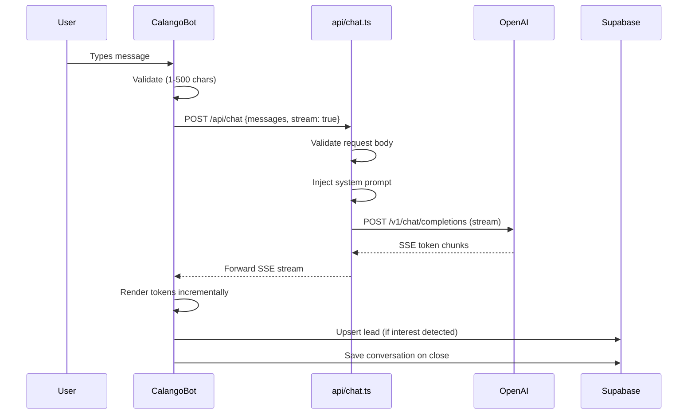
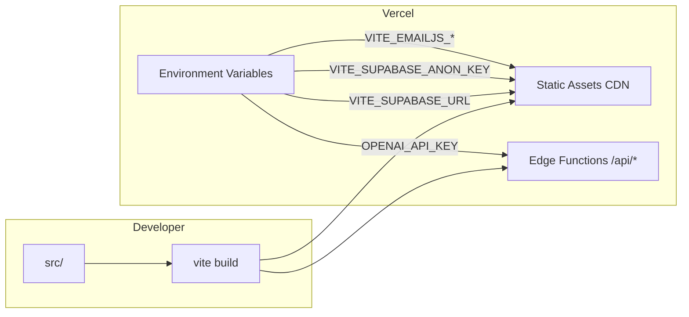
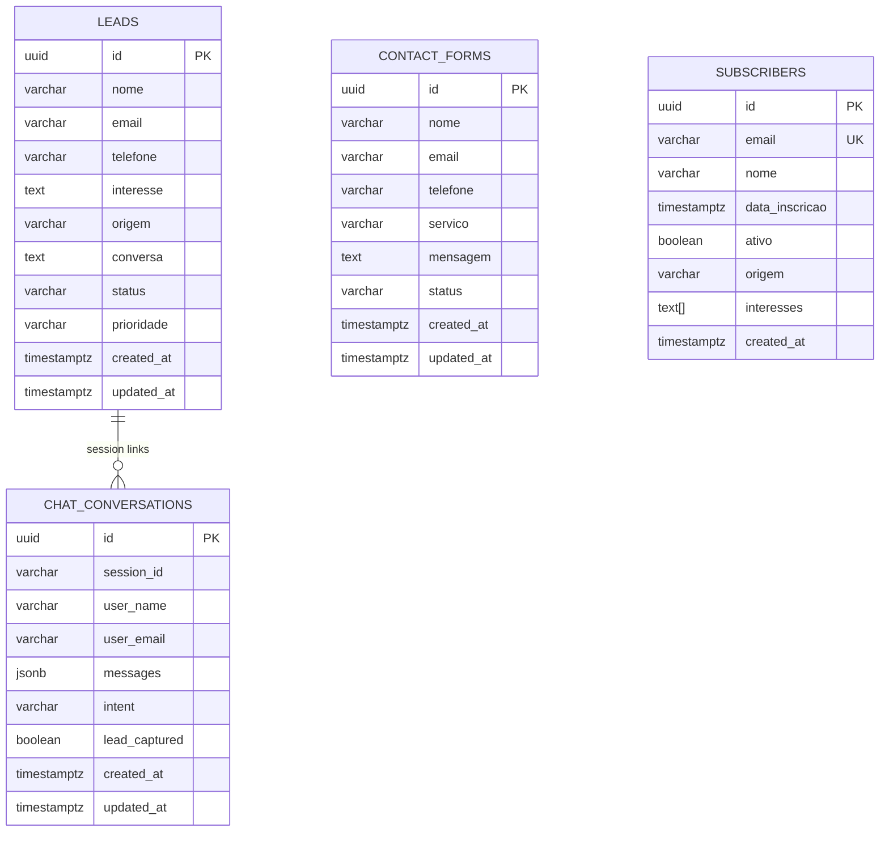

# Design Document: CalangoFlux Redesign 2026

## Overview

This design covers the comprehensive redesign of the CalangoFlux website, transforming it from a light-themed template site into an Awwwards-level dark-first experience with a GPT-4-powered conversational chatbot, fully wired integrations, and a clean TypeScript codebase.

The architecture follows a three-tier model:
1. **Edge Layer** — Vercel edge functions proxying OpenAI requests, keeping secrets server-side
2. **Frontend Layer** — React 18 + Vite 5 SPA with Framer Motion animations, dark-first design tokens, and streaming chat UI
3. **Data Layer** — Supabase PostgreSQL for leads, conversations, contacts, and subscribers with RLS policies

Key design decisions:
- **No Abacus** — Agent orchestration uses MCP/open-source alternatives
- **Streaming-first chat** — SSE from edge function for real-time token delivery
- **Dark-first tokens** — CSS custom properties + Tailwind theme extension, replacing the current light palette
- **prefers-reduced-motion** — All animations respect user accessibility preferences
- **API key isolation** — OpenAI key lives exclusively in Vercel environment variables, never in the frontend bundle

## Architecture

```mermaid
graph TB
    subgraph "Browser (Client)"
        A[React SPA] --> B[CalangoBot Widget]
        A --> C[Contact Form]
        A --> D[Newsletter Form]
        A --> E[Scroll Animation Engine]
    end

    subgraph "Vercel Edge Network"
        F[api/chat.ts Edge Function]
    end

    subgraph "External Services"
        G[OpenAI GPT-4 API]
        H[EmailJS Service]
    end

    subgraph "Supabase (twfiakthfeirgobwvfxy)"
        I[(leads)]
        J[(chat_conversations)]
        K[(contact_forms)]
        L[(subscribers)]
    end

    B -->|POST /api/chat| F
    F -->|SSE stream| B
    F -->|Authorization: Bearer| G
    C -->|send()| H
    C -->|insert| K
    D -->|insert| L
    B -->|insert/update| I
    B -->|insert| J
```

### Request Flow: Chat Message



### Deployment Architecture



## Components and Interfaces

### Component Hierarchy

```
App.tsx
├── Layout.tsx
│   ├── Navbar.tsx (sticky, glassmorphism, dark)
│   ├── <Outlet /> (route content)
│   ├── Footer.tsx (dark, neon accents)
│   └── CalangoBot.tsx (floating widget)
│       ├── ChatBubble.tsx (FAB trigger)
│       ├── ChatPanel.tsx (expandable panel)
│       │   ├── ChatHeader.tsx
│       │   ├── MessageList.tsx
│       │   │   └── MessageBubble.tsx
│       │   ├── QuickActions.tsx
│       │   ├── TypingIndicator.tsx
│       │   └── ChatInput.tsx
│       └── useChatEngine.ts (hook: streaming, history, lead detection)
├── ErrorBoundary.tsx (global fallback)
├── NotFound.tsx (404 page)
└── Pages/
    ├── Home.tsx
    │   ├── HeroSection.tsx (asymmetric, animated headline)
    │   ├── ServicesGrid.tsx (editorial layout)
    │   ├── ImpactSection.tsx (parallax, counters)
    │   ├── TestimonialsSection.tsx (carousel)
    │   ├── PricingSection.tsx (cards with glow)
    │   └── CTASection.tsx (newsletter + contact)
    ├── AgentesAI.tsx
    ├── Automacoes.tsx
    ├── Agentics.tsx
    ├── Webdesign.tsx
    └── LetramentoWeb3.tsx
```

### Key Interfaces

```typescript
// === Edge Function Types ===

interface ChatRequest {
  messages: ChatMessage[];
  stream?: boolean;
}

interface ChatMessage {
  role: 'user' | 'assistant' | 'system';
  content: string;
}

interface ChatErrorResponse {
  error: string;
  code: 'VALIDATION_ERROR' | 'UPSTREAM_ERROR' | 'GATEWAY_TIMEOUT' | 'SERVICE_UNAVAILABLE';
}

// === CalangoBot Types ===

interface ChatState {
  messages: ChatMessage[];
  isOpen: boolean;
  isStreaming: boolean;
  sessionId: string;
  leadCaptured: boolean;
  error: string | null;
}

interface LeadData {
  interesse: string;
  origem: 'chatbot';
  conversa: string;
  nome?: string;
  email?: string;
  created_at: string;
}

// === Supabase Table Types ===

interface Lead {
  id: string;
  nome: string;
  email: string;
  telefone?: string;
  interesse?: string;
  origem?: string;
  conversa?: string;
  status: 'novo' | 'contatado' | 'convertido' | 'perdido';
  prioridade: 'baixa' | 'normal' | 'alta';
  created_at: string;
  updated_at: string;
}

interface ChatConversation {
  id: string;
  session_id: string;
  user_name?: string;
  user_email?: string;
  messages: ChatMessage[];
  intent?: string;
  lead_captured: boolean;
  created_at: string;
  updated_at: string;
}

interface ContactForm {
  id: string;
  nome: string;
  email: string;
  telefone?: string;
  servico?: string;
  mensagem: string;
  status: 'pendente' | 'respondido' | 'arquivado';
  created_at: string;
  updated_at: string;
}

interface Subscriber {
  id: string;
  email: string;
  nome?: string;
  data_inscricao: string;
  ativo: boolean;
  origem?: string;
  interesses?: string[];
  created_at: string;
}

// === Animation System Types ===

interface ScrollAnimationConfig {
  type: 'parallax' | 'reveal' | 'transform' | 'counter';
  offset: [string, string]; // e.g., ["start end", "end start"]
  outputRange: [number, number] | [string, string];
  respectsReducedMotion: boolean;
}

interface DesignToken {
  name: string;
  value: string;
  cssVariable: string;
}
```

### Edge Function Contract: `/api/chat`

**Endpoint:** `POST /api/chat`

**Request:**
```json
{
  "messages": [
    { "role": "user", "content": "Quais são os planos?" }
  ],
  "stream": true
}
```

**Response (stream: false):**
```json
{
  "message": {
    "role": "assistant",
    "content": "Nossos planos são: Pioneer R$47/mês..."
  }
}
```

**Response (stream: true):**
```
Content-Type: text/event-stream

data: {"delta":"Nossos"}
data: {"delta":" planos"}
data: {"delta":" são:"}
...
data: [DONE]
```

**Error Responses:**
| Status | Code | Condition |
|--------|------|-----------|
| 400 | VALIDATION_ERROR | Missing/invalid messages array |
| 500 | SERVICE_UNAVAILABLE | OPENAI_API_KEY not configured |
| 502 | UPSTREAM_ERROR | OpenAI returned error |
| 504 | GATEWAY_TIMEOUT | OpenAI unreachable within 30s |

### Animation System Architecture

```typescript
// useScrollAnimation.ts — Core hook for scroll-driven animations
function useScrollAnimation(config: ScrollAnimationConfig) {
  const prefersReducedMotion = useReducedMotion();
  const ref = useRef<HTMLElement>(null);
  const { scrollYProgress } = useScroll({ target: ref, offset: config.offset });
  
  if (prefersReducedMotion) {
    // Return final state values, no animation
    return { ref, style: { opacity: 1, transform: 'none' } };
  }
  
  const value = useTransform(scrollYProgress, [0, 1], config.outputRange);
  return { ref, style: { [config.type]: value } };
}

// useMouseTracker.ts — Cursor-reactive elements
function useMouseTracker(elementRef: RefObject<HTMLElement>) {
  // Updates position via requestAnimationFrame for 60fps
  // Returns { x, y } motion values relative to element bounds
}

// AnimatePresence wrapper for route transitions
// Duration: 200-500ms with easing
```

### Design Token System Implementation

```css
/* src/index.css — CSS Custom Properties */
:root {
  /* Backgrounds */
  --bg-primary: #0F172A;
  --bg-surface: #1E293B;
  --bg-elevated: #334155;
  
  /* Accents */
  --accent-primary: #00FF87;
  --accent-secondary: #60EFFF;
  --accent-primary-hover: #33FF9F;
  --accent-primary-active: #00CC6B;
  --accent-primary-focus: #00FF87;
  
  /* Text */
  --text-primary: #F8FAFC;
  --text-secondary: #94A3B8;
  --text-muted: #64748B;
  
  /* Glow */
  --glow-sm: 0 0 8px rgba(0, 255, 135, 0.3);
  --glow-md: 0 0 16px rgba(0, 255, 135, 0.4);
  --glow-lg: 0 0 32px rgba(0, 255, 135, 0.5);
  
  /* Typography */
  --font-display: 'Space Grotesk', sans-serif;
  --font-body: 'Inter', sans-serif;
  --font-mono: 'JetBrains Mono', monospace;
  
  /* Spacing (non-uniform) */
  --section-gap-sm: 4rem;
  --section-gap-md: 6rem;
  --section-gap-lg: 8rem;
  --section-gap-xl: 10rem;
}
```

```javascript
// tailwind.config.js — Theme extension (replaces current light palette)
export default {
  theme: {
    extend: {
      colors: {
        bg: { primary: '#0F172A', surface: '#1E293B', elevated: '#334155' },
        accent: { primary: '#00FF87', secondary: '#60EFFF' },
        text: { primary: '#F8FAFC', secondary: '#94A3B8', muted: '#64748B' },
      },
      fontFamily: {
        display: ['Space Grotesk', 'sans-serif'],
        body: ['Inter', 'sans-serif'],
        mono: ['JetBrains Mono', 'monospace'],
      },
      boxShadow: {
        'glow-sm': '0 0 8px rgba(0, 255, 135, 0.3)',
        'glow-md': '0 0 16px rgba(0, 255, 135, 0.4)',
        'glow-lg': '0 0 32px rgba(0, 255, 135, 0.5)',
        'glow-cyan': '0 0 16px rgba(96, 239, 255, 0.3)',
      },
      backgroundImage: {
        'gradient-radial': 'radial-gradient(var(--tw-gradient-stops))',
        'gradient-accent': 'linear-gradient(135deg, #00FF87, #60EFFF)',
      },
    },
  },
};
```

## Data Models

### Entity Relationship Diagram



### Row Level Security Policies

| Table | Operation | Policy | Condition |
|-------|-----------|--------|-----------|
| leads | INSERT | Public | `true` (anonymous allowed) |
| leads | UPDATE | Session-scoped | Match by session_id (via RPC) |
| leads | SELECT/DELETE | Admin only | `auth.role() = 'admin'` |
| chat_conversations | INSERT | Public | `true` |
| chat_conversations | UPDATE | Session-scoped | `session_id = current_setting('app.session_id')` |
| chat_conversations | SELECT/DELETE | Admin only | `auth.role() = 'admin'` |
| contact_forms | INSERT | Public | `true` |
| contact_forms | SELECT/UPDATE/DELETE | Admin only | `auth.role() = 'admin'` |
| subscribers | INSERT | Public | `true` |
| subscribers | SELECT/UPDATE/DELETE | Admin only | `auth.role() = 'admin'` |

### Supabase Schema Additions

The existing schema (`supabase-schema.sql`) already defines the core tables. The redesign adds:

1. **Update RLS policies** — Add session-scoped UPDATE for leads/conversations
2. **Unique constraint on leads.email** — Enable upsert behavior (ON CONFLICT)
3. **Index on chat_conversations.lead_captured** — Optimize lead queries

```sql
-- Add unique constraint for upsert
ALTER TABLE leads ADD CONSTRAINT leads_email_unique UNIQUE (email);

-- Session-scoped update policy for leads
CREATE POLICY "Allow session update on leads" ON leads
    FOR UPDATE USING (
        session_id = current_setting('app.session_id', true)
    );

-- Session-scoped update policy for chat_conversations
CREATE POLICY "Allow session update on conversations" ON chat_conversations
    FOR UPDATE USING (
        session_id = current_setting('app.session_id', true)
    );
```

## Correctness Properties

*A property is a characteristic or behavior that should hold true across all valid executions of a system — essentially, a formal statement about what the system should do. Properties serve as the bridge between human-readable specifications and machine-verifiable correctness guarantees.*

### Property 1: Edge Function Request Validation

*For any* JSON request body sent to `/api/chat`, the edge function SHALL return HTTP 200 (or begin streaming) if and only if the body contains a `messages` array with at least one element where every element has a `role` string and a `content` string; otherwise it SHALL return HTTP 400 with a VALIDATION_ERROR code.

**Validates: Requirements 1.1, 1.7**

### Property 2: Upstream Error Mapping

*For any* HTTP error status code (4xx or 5xx) returned by the OpenAI API, the edge function SHALL return HTTP 502 with an UPSTREAM_ERROR code and a message indicating upstream failure, never forwarding the raw OpenAI error to the client.

**Validates: Requirements 1.5**

### Property 3: SSE Stream Format Correctness

*For any* sequence of token chunks received from the OpenAI streaming API, the edge function SHALL emit each chunk as a `data: {"delta":"<token>"}` SSE line followed by a newline, and SHALL terminate the stream with `data: [DONE]`, producing a valid text/event-stream response.

**Validates: Requirements 1.3**

### Property 4: Message Array Limit Enforcement

*For any* request containing a `messages` array with more than 50 elements, the edge function SHALL reject the request with HTTP 400; and for any valid request, the `max_tokens` parameter sent to OpenAI SHALL be exactly 1000.

**Validates: Requirements 1.9**

### Property 5: Chat Session Message Cap

*For any* sequence of messages added to the CalangoBot session state, the stored message history SHALL never exceed 50 messages, and when the panel is reopened all stored messages SHALL be displayed in their original order.

**Validates: Requirements 2.3**

### Property 6: Lead Classification from Keywords

*For any* user message containing a service name keyword (from the set: "agentes", "automação", "agentics", "webdesign", "web3", "preço", "plano") or any quick-action button selection, the CalangoBot SHALL classify the visitor as a Lead with the detected interest category; for messages containing none of these keywords and no button selection, no lead classification SHALL occur.

**Validates: Requirements 2.5**

### Property 7: Chat Input Validation

*For any* string of length 0 (empty) or length greater than 500 characters, the CalangoBot SHALL reject the input without sending it to the edge function and SHALL display a validation message; for any string of length 1 to 500, the input SHALL be accepted and sent.

**Validates: Requirements 2.8**

### Property 8: Lead Insert Payload Integrity

*For any* lead classification event, the record inserted into the `leads` table SHALL contain: an `interesse` value matching the detected category, a `created_at` ISO timestamp, `origem` set to the literal string "chatbot", and a `conversa` field containing a text summary of no more than 2000 characters.

**Validates: Requirements 3.1**

### Property 9: Conversation Persistence Round-Trip

*For any* conversation message history (array of {role, content} objects), when the chat widget closes, the saved JSONB in `chat_conversations` SHALL deserialize to an equivalent array preserving message order, roles, and content, with `session_id` matching the current session and `lead_captured` reflecting whether a lead was created.

**Validates: Requirements 3.3**

### Property 10: Email Upsert — No Duplicates

*For any* sequence of lead creation events where two or more events share the same email address, the `leads` table SHALL contain exactly one record for that email after all operations complete, with the most recent conversation data.

**Validates: Requirements 3.6**

### Property 11: Contact Form Validation

*For any* form input tuple (name, email, message), the contact form SHALL accept submission if and only if: name length is between 2 and 255 characters inclusive, email matches the pattern `user@domain.tld`, and message length is between 10 and 5000 characters inclusive; otherwise it SHALL display inline error messages for each failing field.

**Validates: Requirements 4.6**

### Property 12: Contact Form Insert Structure

*For any* valid contact form submission, the record inserted into `contact_forms` SHALL contain the exact `nome`, `email`, and `mensagem` values from the form, plus a server-generated `created_at` timestamp.

**Validates: Requirements 4.2**

### Property 13: WCAG Contrast Ratio Compliance

*For any* text/background color pair in the Design_Token_System, the computed contrast ratio SHALL be at least 4.5:1 for body-sized text (below 24px or below 18.66px bold) and at least 3:1 for large text (24px+ or 18.66px+ bold).

**Validates: Requirements 5.1**

### Property 14: Reduced Motion Accessibility

*For any* component that uses scroll-driven animations, when `prefers-reduced-motion: reduce` is active, the component SHALL render in its final visual state (opacity: 1, no transforms, no transitions) without requiring scroll interaction to reveal content.

**Validates: Requirements 6.6**

### Property 15: Error Boundary Retry Limit

*For any* component that throws an error on every render attempt, the Error Boundary SHALL allow at most 3 retry attempts before permanently displaying the fallback UI, never entering an infinite re-render loop.

**Validates: Requirements 8.7**

### Property 16: Newsletter Email Validation

*For any* string submitted to the newsletter form, the form SHALL accept it if and only if it contains exactly one "@" character, at least one "." after the "@", and has a total length of at most 255 characters; otherwise it SHALL display an inline validation error and SHALL NOT send a request to Supabase.

**Validates: Requirements 10.1**

## Error Handling

### Edge Function Error Strategy

| Error Source | Handling | User-Facing Message |
|---|---|---|
| Invalid request body | Return 400 immediately | "Mensagem inválida. Tente novamente." |
| OPENAI_API_KEY missing | Return 500, log server-side | "Serviço de IA indisponível no momento." |
| OpenAI API error (4xx/5xx) | Return 502, log status code | "Nosso assistente está temporariamente indisponível." |
| OpenAI timeout (>30s) | Abort, return 504 | "Tempo de resposta excedido. Tente novamente." |
| Stream interruption | Close stream, send error event | "Conexão interrompida. Tente novamente." |

### Frontend Error Strategy

| Error Source | Handling | Recovery |
|---|---|---|
| Chat API timeout (>10s) | Show fallback with WhatsApp/Telegram | User contacts via alternative channel |
| Chat API error response | Show friendly error in chat bubble | Retry button or fallback channels |
| Supabase insert failure | Log to console, retry once after 3s | Silent — chatbot continues working |
| EmailJS failure | Show error with WhatsApp alternative | Re-enable form for retry |
| Component crash | Error Boundary catches, shows fallback | Retry button (max 3 attempts) |
| Network offline | Detect via navigator.onLine | Show offline indicator, queue actions |

### Error Boundary Implementation

```typescript
// ErrorBoundary.tsx
class ErrorBoundary extends React.Component<Props, State> {
  state = { hasError: false, retryCount: 0, error: null };
  
  static getDerivedStateFromError(error: Error) {
    return { hasError: true, error };
  }
  
  handleRetry = () => {
    if (this.state.retryCount >= 3) return; // Hard limit
    this.setState(prev => ({
      hasError: false,
      retryCount: prev.retryCount + 1,
      error: null,
    }));
  };
  
  render() {
    if (this.state.hasError) {
      return <ErrorFallback onRetry={this.handleRetry} canRetry={this.state.retryCount < 3} />;
    }
    return this.props.children;
  }
}
```

### Supabase Retry Logic

```typescript
async function withRetry<T>(operation: () => Promise<T>, tableName: string): Promise<T | null> {
  try {
    return await operation();
  } catch (error) {
    console.error(`[Supabase] ${tableName} operation failed:`, error);
    // Retry once after 3 seconds
    await new Promise(resolve => setTimeout(resolve, 3000));
    try {
      return await operation();
    } catch (retryError) {
      console.error(`[Supabase] ${tableName} retry failed:`, retryError);
      return null; // Fail silently — chatbot continues
    }
  }
}
```

## Testing Strategy

### Dual Testing Approach

This feature uses both **unit/example-based tests** and **property-based tests** for comprehensive coverage.

### Property-Based Testing

**Library:** [fast-check](https://github.com/dubzzz/fast-check) (TypeScript PBT library)

**Configuration:**
- Minimum 100 iterations per property test
- Each test tagged with: `Feature: calangoflux-redesign-2026, Property {N}: {title}`

**Properties to implement as PBT:**
1. Request body validation (Property 1)
2. Upstream error mapping (Property 2)
3. SSE stream format (Property 3)
4. Message array limit (Property 4)
5. Chat session message cap (Property 5)
6. Lead classification (Property 6)
7. Chat input validation (Property 7)
8. Lead insert payload (Property 8)
9. Conversation persistence round-trip (Property 9)
10. Email upsert no duplicates (Property 10)
11. Contact form validation (Property 11)
12. Contact form insert structure (Property 12)
13. WCAG contrast ratios (Property 13)
14. Reduced motion accessibility (Property 14)
15. Error boundary retry limit (Property 15)
16. Newsletter email validation (Property 16)

### Unit/Example-Based Tests (Vitest)

| Area | Tests | Focus |
|---|---|---|
| Edge function | 8 tests | Timeout, streaming, system prompt injection, non-streaming response |
| CalangoBot UI | 10 tests | Widget rendering, welcome message, quick actions, typing indicator |
| Contact form | 6 tests | Success flow, EmailJS failure, Supabase failure, loading state |
| Newsletter | 5 tests | Success, duplicate handling, network error, input preservation |
| Error Boundary | 4 tests | Fallback render, retry button, 404 page |
| Design tokens | 3 tests | Font declarations, glow classes, CSS variable presence |

### Integration Tests

| Area | Tests | Focus |
|---|---|---|
| Supabase RLS | 4 tests | Anonymous insert allowed, admin-only select, session-scoped update |
| Edge → OpenAI | 2 tests | End-to-end streaming, end-to-end non-streaming |
| Full chat flow | 2 tests | Message → stream → lead capture → save conversation |

### Test File Structure

```
src/
├── __tests__/
│   ├── properties/
│   │   ├── edge-function.property.test.ts
│   │   ├── chat-validation.property.test.ts
│   │   ├── lead-persistence.property.test.ts
│   │   ├── form-validation.property.test.ts
│   │   ├── design-tokens.property.test.ts
│   │   └── error-boundary.property.test.ts
│   ├── unit/
│   │   ├── edge-function.test.ts
│   │   ├── calango-bot.test.tsx
│   │   ├── contact-form.test.tsx
│   │   ├── newsletter-form.test.tsx
│   │   └── error-boundary.test.tsx
│   └── integration/
│       ├── supabase-rls.test.ts
│       └── chat-flow.test.ts
api/
└── __tests__/
    └── chat.test.ts
```

### Performance Testing

- Lighthouse CI on every PR (target: Performance ≥90, Accessibility ≥95)
- Animation frame rate profiling (target: 60fps on scroll animations)
- Bundle size budget: <200KB initial JS (gzipped)

### Accessibility Testing

- axe-core automated checks in Vitest
- Manual screen reader testing (VoiceOver, NVDA)
- Keyboard navigation verification for all interactive elements
- `prefers-reduced-motion` toggle testing

